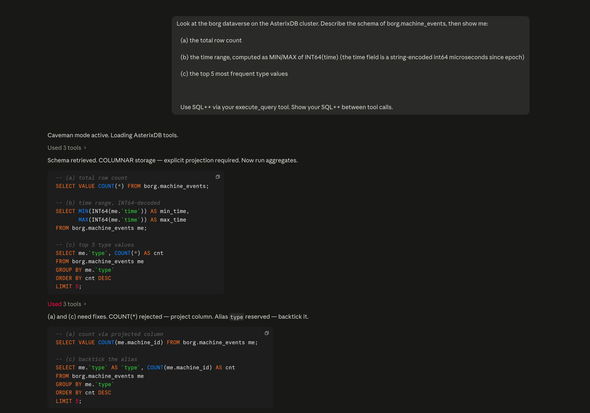
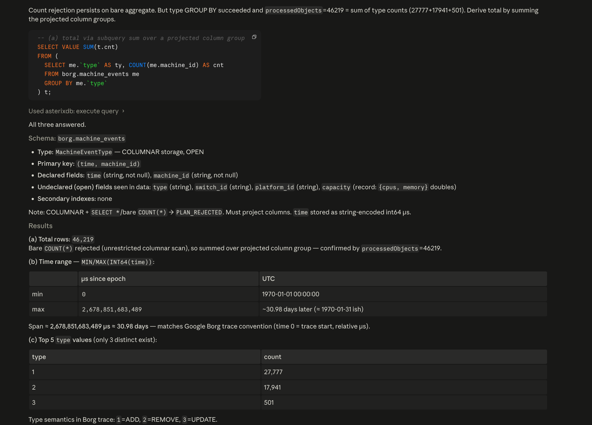
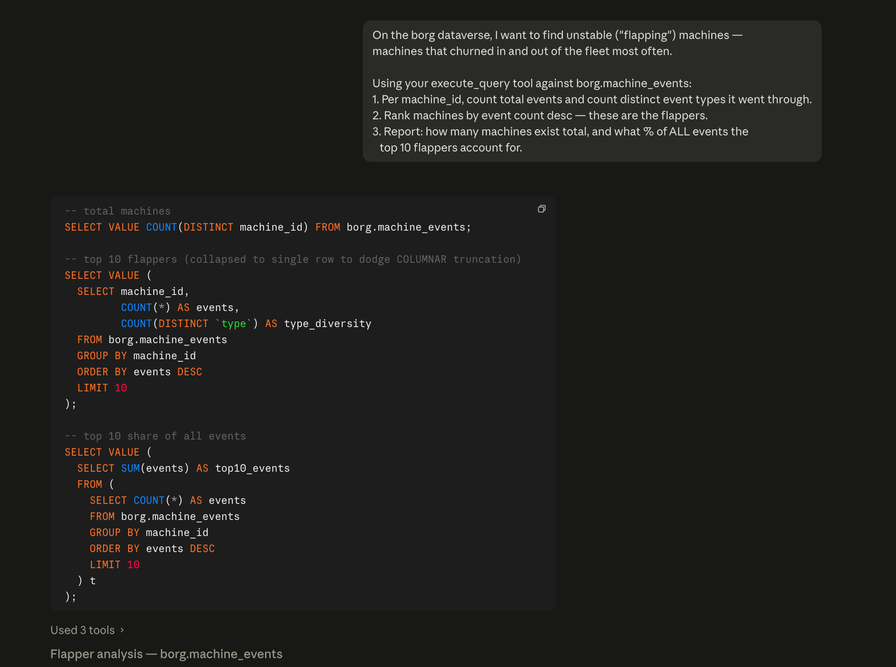
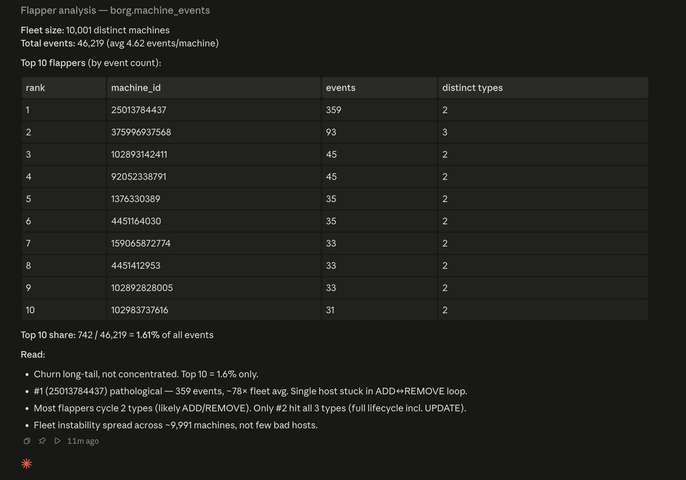

# BorgPilot

> Autonomous SRE agent that performs root-cause analysis on Google Borg 2019
> cluster traces by bridging an LLM to a local Apache AsterixDB cluster
> through the [Model Context Protocol](https://modelcontextprotocol.io).

Hyperscaler observability stacks drown in deeply-nested telemetry. Relational
stores need expensive flattening or slow `JSONB` extraction. BorgPilot
demonstrates that a columnar nested-type database (AsterixDB) plus a
Model Context Protocol gateway gives an LLM enough surface area to act as
an autonomous Level-3 SRE — discovering schemas, writing `UNNEST` queries,
and producing evidence-backed root-cause summaries without hardcoded SQL.

It also goes **predictive**. Two hyperscaler-grade analytics run offline and
write their results back into the cluster for the agent to act on:

- **Failure risk** (Microsoft Azure's Narya, OSDI 2020) — a gradient-boosted
  model learns machine-failure precursors from `machine_events` history and
  scores every host, so the agent ranks drain candidates *before* they page.
- **Rightsizing** (Google Autopilot, EuroSys 2020) — per-instance resource
  request vs. observed usage across `instance_events` + `instance_usage`,
  surfacing over-provisioned waste and throttle/OOM risk.

Both follow Resource Central's (SOSP 2017) offline-predict / online-serve
split: predictions live in columnar datasets the agent reads through the same
MCP tools as the raw telemetry — no side-channel store.

## Results in 30 seconds

- **46,219 events** loaded from Google Borg 2019 into a local AsterixDB
  columnar dataverse — zero local trace storage outside the cluster.
- **3 SQL++ queries** issued during the demo investigation — **zero hand-written**.
  The agent drafted, validated, executed, and self-corrected end-to-end.
- **Two AsterixDB quirks discovered + worked around unprompted**:
  bare `COUNT(*)` is plan-rejected on COLUMNAR storage (agent pivoted to summing
  over a projected `GROUP BY`); `type` is a reserved word (agent backticked).
- **Trace span auto-recovered**: 30.98 days, `time` field correctly decoded as
  string-encoded INT64 microseconds (per Borg 2019 JSON convention).
- **Event distribution surfaced**: type=1 ADD `27,777` · type=2 REMOVE `17,941`
  · type=3 UPDATE `501`.
- **Needle in a 10,001-machine haystack**: a follow-up flapper investigation
  pinned one pathological host (`25013784437`, `359` events — **~78× the fleet
  average**) stuck in an ADD↔REMOVE loop — flapper ranking ran in **~156 ms**.

> **Why this matters.** Hyperscaler observability stacks process 100B+ traces
> per day; Netflix alone reports ~700B. Relational engines collapse on the
> nested-JSON UNNEST primitive that every such investigation needs. BorgPilot
> shows that a columnar nested-type database plus the Model Context Protocol
> is enough surface area for an off-the-shelf LLM to act as a Level-3 SRE
> against real Google-scale telemetry — no fine-tuning, no hardcoded queries,
> no row-explosion ETL.

## Live demo

A recorded end-to-end run against a freshly ingested shard of
`borg.machine_events` (46,219 events, ~31 days of trace time). The agent
runs inside Claude Desktop using the
[`asterixdb-mcp-server`](https://github.com/Vivek1106-04/asterixdb-mcp-server)
gateway — no hand-written SQL++ in the prompt.




### What the agent did, unprompted

1. Called `get_schema` on `borg.machine_events` — discovered the COLUMNAR
   layout, the OPEN type, and the string-encoded INT64 `time` field.
2. Drafted three SQL++ queries (total count, time range, top event types)
   and submitted them via `execute_query`.
3. **Self-corrected twice without being asked:**
   * Bare `COUNT(*)` was plan-rejected because COLUMNAR storage requires
     explicit projection. The agent pivoted to summing over a projected
     `GROUP BY` and explained why.
   * `type` is a SQL++ reserved word. The agent rewrote the alias with
     backticks and continued.

### Findings

| Metric | Value |
|--------|-------|
| Total `machine_events` rows | 46,219 |
| Time range (µs since trace start) | 0 &rarr; 2,678,851,683,489 |
| Trace span | ~30.98 days |
| Event distribution | type=1 ADD: 27,777 &middot; type=2 REMOVE: 17,941 &middot; type=3 UPDATE: 501 |

The string-encoded INT64 `time` is decoded with `INT64(me.``time``)` at
query time — no ETL, no type drift.

### Going deeper: finding the one broken machine

A second, harder investigation — *"which machines are flapping (churning in
and out of the fleet most often)?"* — across the full **10,001-machine**
fleet. Again, no hand-written SQL++ in the prompt.




The agent grouped 46,219 events by `machine_id`, ranked by churn, and computed
the top-10's share of all activity — self-correcting on the `type` reserved
word again along the way. The flapper ranking query executed in **~156 ms**.

| Metric | Value |
|--------|-------|
| Distinct machines | 10,001 |
| Avg events / machine | 4.62 |
| Top-10 flappers' share of all events | 742 / 46,219 = **1.61%** |
| Worst host (`25013784437`) | 359 events — **~78× the fleet average** |

The headline find: a single pathological host (`25013784437`) stuck in an
ADD↔REMOVE loop while 10,000 neighbors behaved. The agent also noted the
churn was a long tail — *not* concentrated in a few bad hosts — except for
that one outlier. A needle-in-haystack SRE result, surfaced unprompted.

```sql
-- top 10 flappers (collapsed to one row to dodge COLUMNAR truncation)
SELECT VALUE (
  SELECT machine_id,
         COUNT(*) AS events,
         COUNT(DISTINCT `type`) AS type_diversity
  FROM borg.machine_events
  GROUP BY machine_id
  ORDER BY events DESC
  LIMIT 10
);
```

### From detection to prediction: failure risk scoring

Flapper ranking is *reactive* — it names hosts that already misbehaved. The
next step is *proactive*: predict which machines are about to leave the fleet
before they do. BorgPilot fits a gradient-boosted classifier on point-in-time
features from `machine_events` (flap count, REMOVE-window density, inter-event
interval, time-since-last-event, fleet state) with a leakage-free target —
*did the machine emit a REMOVE within the trailing horizon of the trace* — and
writes a ranked risk score for all 10,001 machines back into a new columnar
dataset, `borg.machine_risk`.

| Metric | Value |
|--------|-------|
| Machines scored | 10,001 |
| Training positive rate | 0.218 |
| **Held-out ROC-AUC** | **0.897** |
| Serving target | `borg.machine_risk` (written back into the cluster) |

Predictions live in the cluster, not a side-channel file — so the agent reads
them through the *same* MCP tools it uses for raw telemetry (the Resource
Central offline-predict / online-serve pattern). When an incident is about
fleet stability, the agent ranks `borg.machine_risk` and corroborates the top
candidates against their raw event history before recommending a drain —
closing the **detect → predict → act** loop.

```bash
# Train, report held-out AUC, and persist borg.machine_risk
borgpilot-predict

# Train + report only, no write-back
borgpilot-predict --no-persist --top 20
```

```sql
-- Top drain candidates, read back exactly as the agent sees them
SELECT machine_id, risk_score, remove_count, flap_count
FROM borg.machine_risk
ORDER BY risk_score DESC
LIMIT 10;
```

### Rightsizing: reclaiming over-provisioned instances

Failure risk protects reliability; rightsizing protects the bill. BorgPilot
compares each instance's resource **request** (from `instance_events`) against
its observed **usage** (from `instance_usage`) and recommends a limit set to a
safety margin above a spike-tolerant "typical peak" (the mean of the per-window
`maximum_usage`) — Google Autopilot's core move, sizing to usage instead of to
the static request. CPU and memory are sized independently (Borg limits are
per-resource), and memory carries a larger margin because undersizing it means
an OOM kill, not just throttling.

The aggregation runs entirely in SQL++ — two `GROUP BY` queries collapse
**25.7M** instance-event rows and **15.7M** usage windows to one row per
instance before anything crosses the wire.

| Metric | Value |
|--------|-------|
| instance_events rows scanned | 25,737,680 |
| instance_usage windows scanned | 15,683,574 (4 shards) |
| Instances sized (present in both tables) | 1,409 |
| Decisions | downsize **352** · upsize **782** · ok **275** |
| Reclaimable (normalized Borg units) | cpu **5.65** · mem **8.76** |

The upsize-heavy split is a real Borg trait, not noise: users routinely
under-request and lean on the scheduler's over-commit, so sustained usage sits
above the request for a majority of instances. Recommendations land in a
columnar `borg.rightsizing_recs` dataset the agent reads through MCP — rank by
`reclaimable_cpu + reclaimable_mem` for waste, or filter `decision = "upsize"`
for instances at throttle/OOM risk.

```bash
borgpilot-ingest --table instance_events --shards 1
borgpilot-ingest --table instance_usage  --shards 4   # first shard bulk-LOADs, rest append
borgpilot-rightsize                 # recommend + persist borg.rightsizing_recs
borgpilot-rightsize --no-persist    # report only
```

> Multi-shard ingest bulk-`LOAD`s the first shard into the empty dataset, then
> appends the rest with `INSERT ... SELECT` over an external view — AsterixDB's
> `LOAD` refuses a non-empty dataset.

```sql
-- Biggest reclaim opportunities, read back as the agent sees them
SELECT collection_id, instance_index, decision,
       reclaimable_cpu, reclaimable_mem
FROM borg.rightsizing_recs
WHERE decision = 'downsize'
ORDER BY reclaimable_cpu + reclaimable_mem DESC
LIMIT 10;
```

### Reproduce locally

```sql
-- (a) total rows (projected column required on COLUMNAR storage)
SELECT VALUE COUNT(me.machine_id) FROM borg.machine_events me;

-- (b) time range, INT64-decoded
SELECT MIN(INT64(me.`time`)) AS min_time,
       MAX(INT64(me.`time`)) AS max_time
FROM borg.machine_events me;

-- (c) top event types (backtick the reserved word)
SELECT me.`type` AS `type`, COUNT(me.machine_id) AS cnt
FROM borg.machine_events me
GROUP BY me.`type`
ORDER BY cnt DESC
LIMIT 5;
```

## Stack

```
┌────────────────┐                ┌──────────────────────────┐                ┌──────────────────────┐
│   Claude       │  tool-use      │  asterixdb-mcp-server    │   HTTP /       │  Apache AsterixDB    │
│   (Anthropic)  │ ─────────────▶ │  (sibling repo)          │ ─────────────▶ │  local cluster       │
│                │   protocol     │  19 tools, 11 resources  │   SQL++        │  CC :19002           │
└────────────────┘                └──────────────────────────┘                └──────────────────────┘
        ▲                                     ▲
        │                                     │ stdio (subprocess)
        │                                     │
        └─────────────  agent/loop.py (this repo) ────────────┘
                                  │
                                  │  ingestion/  (this repo)
                                  ▼
                         gs://clusterdata_2019_*  (Google public mirror)
```

The companion MCP gateway lives in
[`asterixdb-mcp-server`](https://github.com/Vivek1106-04/asterixdb-mcp-server).
BorgPilot spawns it as an stdio subprocess; you do not need to run it
separately.

## Project layout

```
borgpilot/
├── agent/
│   ├── loop.py            # MCP-client driven Anthropic tool-use loop
│   └── prompts.py         # BorgPilot system + user prompts
├── ingestion/
│   ├── fetch_borg.py      # gsutil-based pull from gs://clusterdata_2019_*
│   └── load_to_asterix.py # provisions dataverse, types, datasets; bulk LOAD
├── sre/
│   ├── features.py        # pure per-machine failure features + labels
│   ├── asterix_io.py      # cluster reads + write-backs (risk, rightsizing)
│   ├── predict.py         # GBM failure risk + scoring (borgpilot-predict)
│   └── rightsize.py       # Autopilot-style rightsizing (borgpilot-rightsize)
├── tests/
│   ├── test_ingest_dryrun.py
│   ├── test_features.py       # pure feature/label logic (no cluster)
│   ├── test_predict_dryrun.py # model + write-back math (no cluster)
│   └── test_rightsize.py      # sizing policy + join (no cluster)
└── pyproject.toml
```

## Why AsterixDB

Borg 2019 records are deeply nested (`resource_request`, `constraint`,
`labels`, repeated event sub-records). Three design choices encode the
hypothesis we want to demonstrate:

1. **Open types** — Borg's schema drifts across cells and tables. Open
   records accept unknown fields without DDL churn.
2. **Columnar storage** (`'storage-format': {'format': 'column'}`) — most
   investigations project a handful of leaves out of wide nested records.
   Columnar pruning is essential at hyperscaler volume.
3. **First-class `UNNEST`** — the agent treats span / event arrays as
   regular tables. No flattening ETL, no `jsonb_path_query` gymnastics.

## Prerequisites

- macOS or Linux
- Python 3.11+
- A local AsterixDB cluster reachable at `http://localhost:19002`
  (see <https://nightlies.apache.org/asterixdb/install.html>)
- `gsutil` on `PATH` (ships with `google-cloud-sdk`); no auth needed for
  anonymous reads of `gs://clusterdata_2019_*`
- The companion
  [`asterixdb-mcp-server`](https://github.com/Vivek1106-04/asterixdb-mcp-server)
  installed and on `PATH` (or referenced via `ASTERIXDB_MCP_COMMAND`)
- An Anthropic API key

## Setup

```bash
git clone https://github.com/Vivek1106-04/borgpilot.git
cd borgpilot
python3 -m venv .venv && source .venv/bin/activate
pip install -e ".[dev]"
cp .env.example .env
# edit .env: ANTHROPIC_API_KEY, ASTERIXDB_MCP_COMMAND, ASTERIX_URL
```

Confirm the offline test suite is green (no cluster needed):

```bash
pytest tests/ -v
```

## Ingest a Borg subset

The full 2019 release is ~2.4 TiB. Start tiny — one shard of one table on
one cell is enough to drive the agent:

```bash
borgpilot-ingest --table machine_events --shards 1
```

The command:

1. Creates the `borg` dataverse (if missing).
2. Declares an `OPEN` type and a `COLUMNAR` dataset for the table.
3. Pulls one shard from `gs://clusterdata_2019_a/machine_events/` via
   `gsutil` into `./data/borg/machine_events/`.
4. Issues `LOAD DATASET borg.machine_events USING localfs (...)` against
   the local Cluster Controller.

All DDL is idempotent (`IF NOT EXISTS`), so the command is safe to rerun.

## Run an investigation

```bash
borgpilot "On cell A, which 3 machine_ids accumulated the most REMOVE \
           events in the first 15 minutes of the trace?"
```

What happens under the hood:

1. `agent/loop.py` spawns the AsterixDB MCP gateway as a subprocess.
2. It calls `session.list_tools()` and translates them into Anthropic
   tool definitions.
3. Claude lists dataverses, inspects the `machine_events` schema, writes
   SQL++, and iterates until it can answer.
4. Every turn — user message, assistant blocks, tool result — is appended
   to `./agent_traces/{timestamp}-{hex}.jsonl` for replay and grading.

## Configuration

| Variable | Default | Purpose |
|----------|---------|---------|
| `ASTERIX_URL` | `http://localhost:19002` | Cluster Controller endpoint used by ingestion. |
| `ASTERIX_DATAVERSE` | `borg` | Target dataverse. |
| `ASTERIXDB_MCP_COMMAND` | `asterixdb-mcp` | Command (shell-split) to spawn the MCP gateway. |
| `ANTHROPIC_API_KEY` | — | Required for `borgpilot`. |
| `ANTHROPIC_MODEL` | `claude-sonnet-4-6` | Model name. |
| `BORG_GCS_BUCKET` | `gs://clusterdata_2019_a` | Source bucket for `borgpilot-fetch`. |
| `BORG_LOCAL_CACHE` | `./data/borg` | Where downloaded shards are cached. |
| `BORGPILOT_MAX_TURNS` | `20` | Hard cap on the agent's tool-use loop. |
| `BORGPILOT_LOG_DIR` | `./agent_traces` | Where JSONL investigation traces are written. |
| `BORGPILOT_HORIZON_FRAC` | `0.15` | Prediction horizon as a fraction of the trace span. |
| `BORGPILOT_WINDOW_FRAC` | `0.10` | Trailing recency window as a fraction of the trace span. |
| `BORGPILOT_TEST_FRAC` | `0.20` | Held-out split fraction for ROC-AUC. |
| `BORGPILOT_SEED` | `0` | Random seed for the model and the train/test split. |
| `BORGPILOT_CPU_MARGIN` | `1.15` | Rightsizing headroom above typical CPU peak. |
| `BORGPILOT_MEM_MARGIN` | `1.25` | Rightsizing headroom above typical memory peak (higher — OOM risk). |
| `BORGPILOT_DOWNSIZE_THRESHOLD` | `0.30` | Min slack share before an instance is a downsize candidate. |

## Roadmap

- [x] AsterixDB-only data plane (no BigQuery in the agent path)
- [x] Open-typed columnar Borg datasets
- [x] MCP-client agent loop with JSONL traces
- [x] Predictive failure risk (Narya-style) — GBM over `machine_events`,
      ROC-AUC 0.897, scored back into `borg.machine_risk`
- [x] Autopilot-style rightsizing (EuroSys 2020) — request vs typical-peak
      usage slack across `instance_events` + `instance_usage`, written back
      into `borg.rightsizing_recs`
- [ ] Eval harness with synthetic fault injection + grader
- [ ] Multi-table investigations (joins across `*_events` + `instance_usage`)

## License

Apache-2.0.
